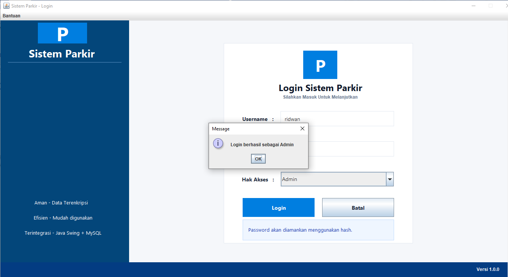
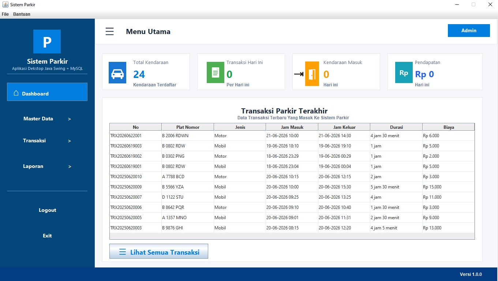
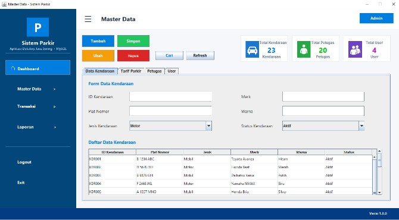
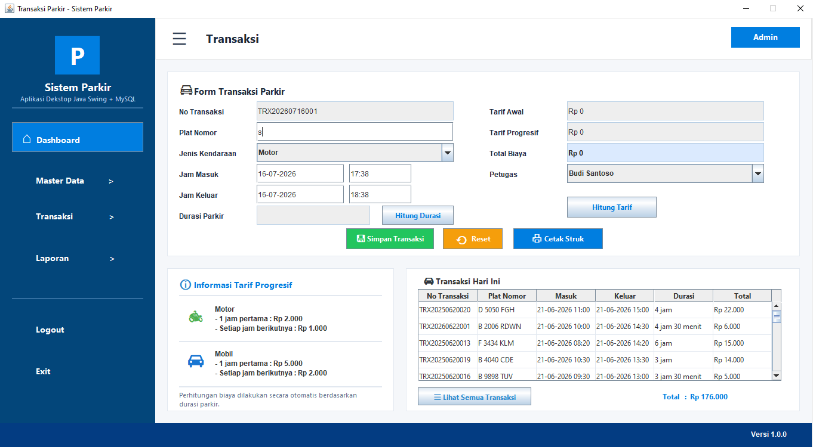
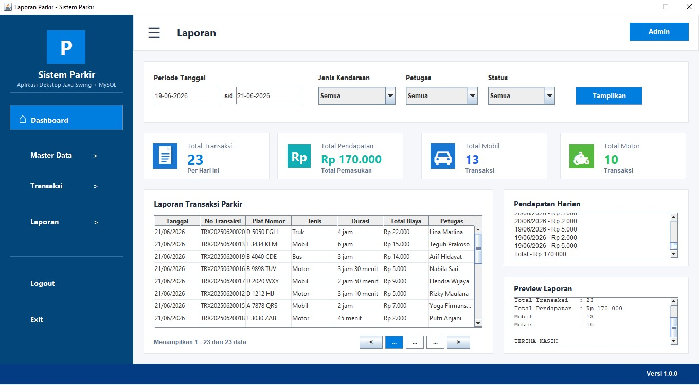

# 🚗 Parking Management System


A desktop-based Parking Management System developed using Java Swing and MySQL.

## 📌 Description

## 📷 Application Preview

### Login


### Dashboard


### Vehicle Management


(images/form_master_data_tarif_parkir.jpg)

(images/form_master_data_petugas.jpg)

(images/form_master_data_user.jpg)

### Parking Transaction


### Report


## ✨ Features

- User Login Authentication
- Dashboard
- Vehicle Data Management (CRUD)
- Parking Staff Management (CRUD)
- Parking Rate Management
- Parking Transactions
- Parking Report
- MySQL Database Integration

## 🛠 Technologies Used

- Java
- Java Swing
- JDBC
- MySQL
- Apache Maven
- NetBeans IDE

## 📂 Project Structure

```
src/
├── main/
│   ├── java/
│   └── resources/
```

## ⚙️ How to Run

1. Clone this repository.
2. Open the project using NetBeans IDE.
3. Import the MySQL database.
4. Configure the database connection.
5. Run the project.

## 👨‍💻 Developer

**Muhammad Ridwan Arifin**

- Informatics Student
- Universitas Pamulang

## 📄 License

This project is created for educational purposes.
