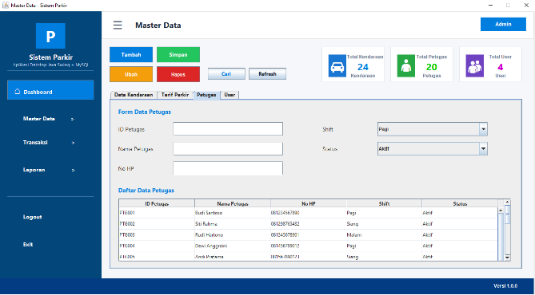
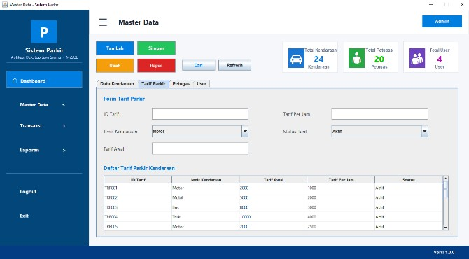
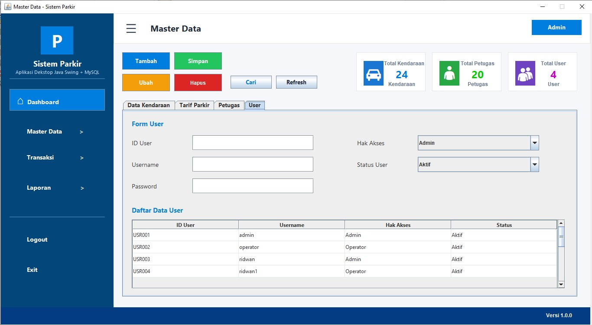

# 🚗 Parking Management System


A desktop-based Parking Management System developed using Java Swing and MySQL.

## 📌 Description

This desktop-based Parking Management System was developed using Java Swing and MySQL as a final project for the Programming course.

The application helps parking attendants manage parking operations efficiently, including:

- Vehicle registration
- Parking transactions
- Staff management
- Parking rate management
- Report generation

## 📷 Application Preview

### 🔐 Login Form


---

### 🏠 Main Dashboard


---

### 🚗 Vehicle Management


---

### 👤 Staff Management



---

### 💰 Parking Rate Management



---

### 👥 User Management



---

### 🎫 Parking Transaction


---

### 📊 Parking Report


---

## 🛠 Tech Stack

| Category | Technology |
|----------|------------|
| Programming Language | Java |
| User Interface | Java Swing |
| Database | MySQL |
| Database Connectivity | JDBC |
| Build Tool | Maven |
| IDE | NetBeans IDE |
| Version Control | Git & GitHub |

---

## ✨ Features

- 🔐 Secure Login Authentication
- 🚗 Vehicle Data Management
- 👨‍💼 Parking Staff Management
- 💰 Parking Rate Management
- 🎫 Parking Transaction Management
- 📊 Parking Report Generation
- 🗄 MySQL Database Integration
- 🔎 Search and Filter Data

---

## 🗄 Database

The SQL database file is available in the **Database** folder.

### Database Name

```text
sistem_parkir
```

Import the SQL file into MySQL before running the application.

---

## ⚙ Installation

1. Clone this repository.

```bash
git clone https://github.com/Muhammad-Ridwan-dev/Sistem-Parkir-Java.git
```

2. Open the project using NetBeans IDE.

3. Import the SQL file from the `Database` folder.

4. Configure the MySQL connection inside `Koneksi.java`.

5. Build and run the project.

---

## 📂 Project Structure

```text
Sistem-Parkir-Java
│
├── Database/
├── images/
├── src/
│   └── main/
│       └── java/
│           └── p17/
├── pom.xml
└── README.md

```

## 🚀 Future Improvements

- Export reports to PDF
- Dashboard analytics
- Multi-user authentication
- Responsive UI improvements
- Cloud database support
  
---

## 👨‍💻 Developer

Muhammad Ridwan Arifin

Informatics Student at Universitas Pamulang

### Skills

- Java
- Java Swing
- JDBC
- MySQL
- HTML
- CSS
- Cisco Packet Tracer
- Microsoft Office
---

## 📄 License

This project was developed for educational purposes as a university final project.

## 🙏 Acknowledgements

This project was developed as part of the Programming course at Universitas Pamulang.
